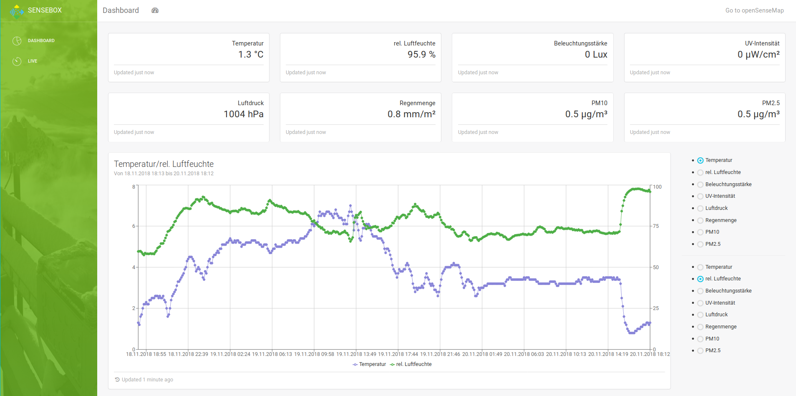

# senseBox Hub 
 This repository contains the code of the Hub that is designed to hold several apps that were built in the senseBox project. To get more information about openSenseMap and senseBox visit the before mentioned links or have a look at this [video](https://www.youtube.com/watch?v=I8ZeT6hzjKQ) or read the [openSenseMap](https://osem.books.sensebox.de/) chapter in our [books](https://books.sensebox.de/).

The Hub can be accessed via [this link](https://dashboardsensebox.netlify.com/#/)

## Getting started 

## Prerequisites

## Installing 

 1. Clone the repository
`git clone https://github.com/sensebox/Hub`
 2. Install Dependencies
 `cd Hub/ && npm install`
 3. Run the app locally in development mode 
 `npm start`

 The `src`-folder contains all files for further development.
`views` contains the components that will get rendered. 
`assets` contains stylesheets, fonts, images.

### Branches 
- master
- development 

## Built with
 - [React](reactjs.org) - The web framework used
 - [HighCharts](https://www.highcharts.com) - Library used for visualizing data 
## License 
This project is licensed under the MIT License - see the LICENSE.md file for details

## Acknowledgments
Thanks to [creativeTim](https://www.creative-tim.com/) for publishing his [Light Bootstrap Dashboard](https://demos.creative-tim.com/light-bootstrap-dashboard-react/#/dashboard) with which the basis of this app has been built.

[senseBox](https://sensebox.de/)
/)
